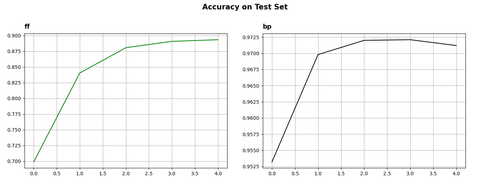

### 이 저장소(Repository)는 「Forward-Forward 알고리즘 구현」에 대한 내용을 다루고 있습니다.

***
작성자: YAGI<br>

최종 수정일: 2023-03-01
+ 2023.03.13: 코드 작성 완료
***

<br>

***
+ 프로젝트 기간: 2023-03-01 ~ (진행 중)
***
<br>

***
+ 해당 프로젝트는 Geoffrey Hinton의 「The Forward-Forward Algorithm: Some Preliminary Investigations」(2022)를 바탕으로 하고 있습니다.
+ 해당 프로젝트는 「pytorch_forward_forward」(2023)을 참조하여 작성하였습니다.

> Geoffrey Hinton. The Forward-Forward Algorithm: Some Preliminary Investigations. [ArXiv, 2212.13345v1, 2022](https://arxiv.org/pdf/2212.13345v1.pdf).

> "pytorch_forward_forward". github. last commit Jan 17, 2022, [https://github.com/mohammadpz/pytorch_forward_forward](https://github.com/mohammadpz/pytorch_forward_forward).
***
<br><br>

## 프로젝트 요약
&nbsp;&nbsp;
본 프로젝트는 MNIST 데이터셋에 대한 Geoffrey Hinton이 제시한 Forward-Forward 알고리즘과 Back Propagation 알고리즘의 정확도를 비교하는 것을 목표로 한다. 두 알고리즘 모두 '784-100-10' 형태의 Fully-Connected 층으로 이루어진 모델을 사용하였으며, 배치 크기는 16으로 설정하고 학습률이 0.1인 확률적 경사 하강법(SGD)으로 총 10회 학습하였다. figure 1은 학습에 따른 테스트 데이터셋에 대한 두 알고리즘의 정확도(Accuracy)를 제시한 것이다.

<br>

**figure 1.** Accuracy on MNIST Test Set


<br><br>

## Getting Start
***

### 매개변수 확인하기
```python
$ python main.py -h

    --mode {INFERENCE,TRAIN}
    --ff_dims FF_DIMS [FF_DIMS ...]
    --bp_dims BP_DIMS [BP_DIMS ...]
    --epoch EPOCH
    --train_batch_size TRAIN_BATCH_SIZE
    --test_batch_size TEST_BATCH_SIZE
    --optimizer {SGD,ADAM}
    --lr LR
    --device {CPU,CUDA}
    --seed SEED
```
<br>

### (1) Train Model
* 학습이 종료되면 `figures` 폴더에 `figure1_accuracy_on_testset.png` 파일이 저장된다.
* 학습이 종료되면 `trained_model` 폴더에 FF 알고리즘 모델과 BP 알고리즘 모델이 저장된다.
```python
$ python main.py --mode TRAIN
```
<br>

### (2) Inference Model
```python
$ python main.py --mode INFERENCE

>>>
    + Accuracy on MNIST Test Set
        FF Model: 0.905
        BP Model: 0.974
```

***

<br><br>

## 개발 환경
**Language**: Python 3.9.12

**Library**

    + matplotlib 3.6.2
    + pytorch 1.12.0
    + tqdm 4.64.1

<br><br>

## License
This project is licensed under the terms of the [MIT license](https://github.com/YAGI0423/forward_forward_algorithm/blob/main/LICENSE).